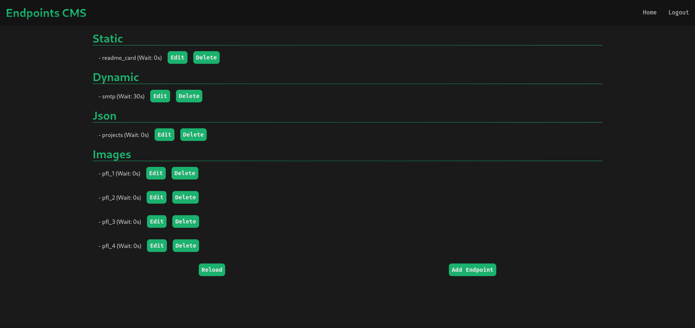
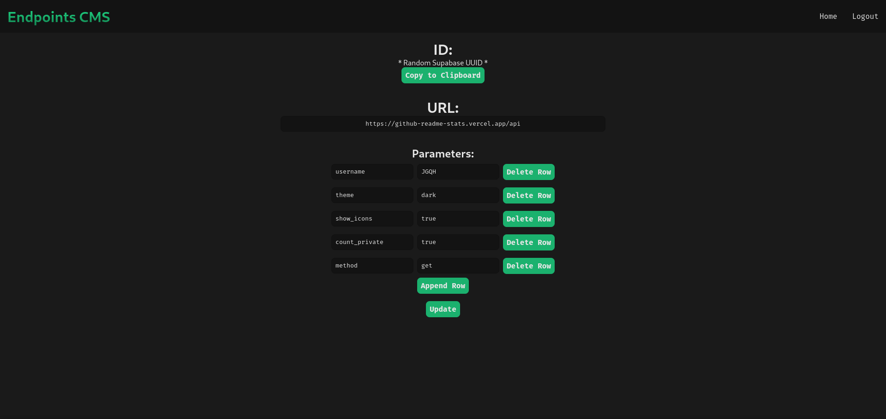

# JGQH-CMS
> English not my first language

NextJS to be the CMS / Redirecter for other projects

## Table of contents
- [Introduction](#introduction)
- [Technologies](#technologies)
- [Illustrations](#illustrations)
- [To-Do](#to-do)

## Introduction
This project is a TypeScript introduction to use Supabase for managing content of other projects. This project will allow me to:
- Set redirect for especific URLs
- Host information of other projects in JSON format
- Upload images

## Technologies
- React v17.0.2
- [Next](https://www.npmjs.com/package/next) v11.0.1
- [Supabase](https://www.npmjs.com/package/@supabase/supabase-js) v1.20.0
## Illustrations
| HomePage (After Login) | Example of an 'endpoint' |
| :--------------------: | :----------------------: |
|  | 

## To-Do